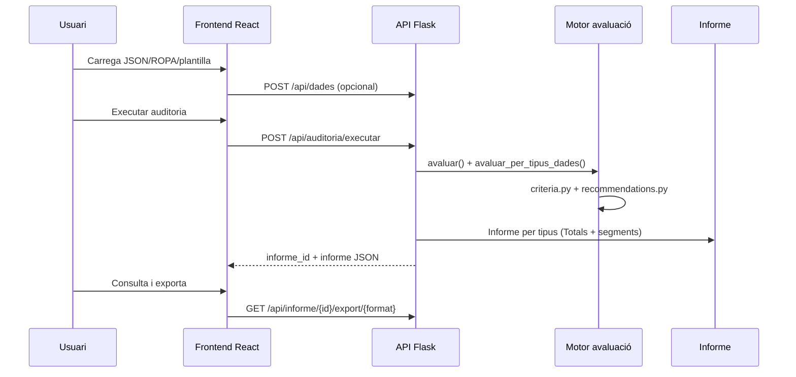

# Documentació del codi — Eina d'auditoria de privacitat

Referència completa de l'estructura del projecte, cada arxiu, classe, funció i endpoint API.

---

## Índex

1. [Visió general i flux de dades](#1-visió-general-i-flux-de-dades)
2. [Relació entre mòduls](#2-relació-entre-mòduls)
3. [Backend Python (`eina_auditoria_priv/`)](#3-backend-python)
4. [Frontend React (`frontend/src/`)](#4-frontend-react)
5. [Plantilles HTML legacy](#5-plantilles-html-legacy)
6. [Dades d'exemple (`dades_exemple/`)](#6-dades-dexemple)
7. [Endpoints API REST](#7-endpoints-api-rest)

---

## 1. Visió general i flux de dades



**Entrada:** JSON amb organització, tractaments, política de privacitat, configuració d'accés i checklist de controls.

**Sortida:** Informe amb findings (resultats per criteri), riscos identificats i recomanacions prioritzades, segmentat per tipus de dades.

---

## 2. Relació entre mòduls

```
webapp.py ──► api_routes.py ──► model.py
     │              │                │
     │              ├── evaluator.py ◄── criteria.py ◄── constants.py
     │              ├── recommendations.py
     │              ├── reports.py
     │              ├── ropa_import.py
     │              └── csv_import.py
     │
cli.py ──────────► evaluator.py + recommendations.py + reports.py
```

| Mòdul | Importa | És importat per |
|-------|---------|-----------------|
| `model.py` | — | Tots els mòduls de negoci |
| `constants.py` | — | `criteria.py`, `api_routes.py`, `ropa_import.py` |
| `criteria.py` | `model`, `constants` | `evaluator.py`, `api_routes.py` |
| `evaluator.py` | `model`, `criteria` | `api_routes.py`, `webapp.py`, `cli.py`, `recommendations.py` |
| `recommendations.py` | `criteria`, `evaluator` | `api_routes.py`, `webapp.py`, `cli.py`, `reports.py` |
| `reports.py` | `evaluator`, `recommendations`, `model` | `api_routes.py`, `webapp.py`, `cli.py` |

---

## 3. Backend Python

### 3.1 `__init__.py`

| Element | Descripció |
|---------|------------|
| `__version__` | Versió del paquet (`"0.1.0"`) |

Defineix el paquet Python `eina_auditoria_priv`.

---

### 3.2 `model.py` — Model de dades d'entrada

Defineix l'estructura JSON que l'eina accepta com a entrada d'auditoria.

#### Classes

| Classe | Descripció |
|--------|------------|
| `Tractament` | Activitat de tractament de dades personals (registre d'activitats art. 30 RGPD) |
| `PoliticaPrivacitat` | Existència i adequació de la política de privacitat / deure d'informació |
| `ConfiguracioAcces` | Control d'accés, registre d'accions i formació |
| `DadesEntradaAuditoria` | Conjunt complet d'entrada per a una auditoria |

#### Camps principals de `Tractament`

| Camp | Tipus | Descripció |
|------|-------|------------|
| `id`, `nom`, `finalitat` | str | Identificació i finalitat del tractament |
| `base_legal` | list[str] | Bases legals (consentiment, contracte, obligació legal, etc.) |
| `categories_dades` | list[str] | Categories de dades personals tractades |
| `destinataris` | list[str] | Destinataris de les dades |
| `transferencies_internacionals` | bool | Si hi ha transferències fora de l'EEE |
| `termini_conservacio` | str | Termini (predefinit o "N unitat") |
| `mesures_seguretat` | list[str] | IDs de mesures de seguretat aplicades |
| `dpo_assignat` | bool | Si el tractament té DPO assignat |
| `tipus_dades` | str | Segmentació per informe (treballadors, clients, etc.) |
| `conte_dades_sensibles` | bool | Dades de categoria especial (art. 9) |
| `notes` | str | Notes lliures |

#### Mètodes

| Mètode | Classe | Descripció |
|--------|--------|------------|
| `to_dict()` | Totes les classes | Serialitza a diccionari per JSON/sessió |
| `from_dict(d)` | `DadesEntradaAuditoria` | Construeix l'objecte des d'un diccionari JSON; normalitza booleans, llistes i checklist |

**Funcions internes de `from_dict`:** `_normalize_base_legal`, `_bool`, `_to_list`, `_termini_str` — normalització de tipus des de JSON heterogeni.

---

### 3.3 `constants.py` — Constants compartides

| Constant | Descripció |
|----------|------------|
| `MESURES_SEGURETAT_PREDEFINIDES` | Llista de mesures (id, nom, descripció) seleccionables a la UI |
| `CATEGORIES_SENSIBLES_IDS` | IDs de categories que impliquen dades especials (art. 9) |
| `CATEGORIES_ALTRISC_XIFRAT` | Categories (NIF, bancàries) que haurien de tenir xifrat |
| `TERMINI_IDS_ADEQUATS` | Terminis predefinits considerats documentats |
| `CONTROL_SATISFET_PER_MESURA` | Mapatge control → mesures que el satisfan automàticament |
| `TERMINI_OPCIONS_PREDEFINIDES` | Opcions de termini per al formulari |
| `TERMINI_UNITATS` | Unitats (dies, mesos, anys) per terminis numèrics |
| `CATEGORIES_DADES_PREDEFINIDES` | Categories de dades personals preestablertes |

---

### 3.4 `criteria.py` — Criteris d'avaluació RGPD/ISO

Motor de criteris normatius. Cada criteri retorna una llista de findings: `(resultat, descripció, nivell_risc, tractament_id, tractament_nom)`.

#### Enumeracions

| Enum | Valors | Descripció |
|------|--------|------------|
| `NivellRisc` | alt, mitja, baix, informat | Gravetat del finding |
| `ResultatCriteri` | compleix, no_compleix, no_aplicable, sense_dades | Resultat de l'avaluació |

#### Classe `Criteri`

| Camp | Descripció |
|------|------------|
| `id` | Identificador únic (ex. `RGPD_ART6_BASE_LEGAL`) |
| `nom` | Nom llegible del criteri |
| `descripcio` | Descripció breu |
| `referencia_normativa` | Referència legal |
| `nivell_risc_defecte` | Nivell de risc per defecte |
| `avaluar` | Funció callable que avalua les dades |

#### Criteris automàtics (sense checklist)

| Funció | ID | Descripció |
|--------|-----|------------|
| `_criteri_base_legal` | RGPD_ART6_BASE_LEGAL | Cada tractament ha de tenir base legal |
| `_criteri_finalitat_definida` | RGPD_ART5_FINALITAT | Finalitat determinada i documentada |
| `_criteri_termini_conservacio` | RGPD_ART5_TERMINI | Termini de conservació definit |
| `_criteri_termini_adequacio` | RGPD_ART5_TERMINI_ADEQUACIO | Terminis indefinits o >10 anys (informatiu) |
| `_criteri_politica_privacitat` | RGPD_ART13_14_POLITICA | Política existent, accessible i completa |
| `_criteri_registre_activitats` | RGPD_ART30_REGISTRE | Presència de tractaments declarats |
| `_criteri_mesures_seguretat` | RGPD_ART32_MESURES | Mesures de seguretat documentades |
| `_criteri_acces_restringit` | RGPD_ACCES_RESTRINGIT | Accés restringit per rol |
| `_criteri_registre_accions` | REGISTRE_ACCIONS | Registre d'accions sobre dades |
| `_criteri_dpo` | RGPD_ART37_DPO | DPO assignat quan cal |
| `_criteri_transferencies` | RGPD_CAP5_TRANSFERENCIES | Garanties en transferències internacionals |

#### Funcions auxiliars

| Funció | Descripció |
|--------|------------|
| `_un(res, desc, nivell)` | Retorna un sol finding sense tractament (General) |
| `_mesures_set(tractament)` | Conjunt d'ids de mesures normalitzats |
| `_categories_sensibles(tractament)` | True si inclou categories art. 9 |
| `_categories_altrisc_xifrat(tractament)` | True si inclou NIF/dades bancàries |
| `_termini_anys_numerics(termini)` | Converteix termini a anys (ex. "18 mesos" → 1.5) |
| `_avaluar_estructurat(control_id, d, nivell)` | Avaluació automàtica per dades estructurades (categories, mesures, termini, sensibles, PIA, xifrat) |
| `_criteri_checklist(...)` | Factory de criteris basats en checklist manual + estructurat + mesures |
| `get_checklist_metadata()` | Retorna metadades dels controls del checklist per a la UI |

#### Llista `CRITERIS`

Conté tots els criteris automàtics més ~30 controls del checklist (RGPD arts. 5-35, ISO 27701 Annex A i B), generats dinàmicament des de `_CONTROLS_CHECKLIST`.

---

### 3.5 `evaluator.py` — Motor d'avaluació

| Classe | Descripció |
|--------|------------|
| `Finding` | Resultat d'un criteri (pot anar lligat a un tractament) |
| `RiscIdentificat` | Risc derivat d'un finding NO_COMPLEIX |
| `ResultatAvaluacio` | Conjunt de findings, riscos i resum |

| Funció | Descripció |
|--------|------------|
| `avaluar(dades)` | Executa tots els criteris; duplica findings amb tractament com a "General" per a la pestanya Totals |
| `avaluar_per_tipus_dades(dades)` | Avaluació segmentada per `tipus_dades` de cada tractament |
| `_identificar_riscos(findings)` | Genera un risc per cada finding NO_COMPLEIX |
| `_calcula_resum()` | Compta resultats per tipus i per nivell de risc |

---

### 3.6 `recommendations.py` — Recomanacions

| Classe | Descripció |
|--------|------------|
| `Recomanacio` | Recomanació accionable amb accions concretes i prioritat |

| Element | Descripció |
|---------|------------|
| `MAPA_RECOMANACIONS` | Diccionari criteri_id → llista de recomanacions (títol, descripció, accions, referència) |
| `generar_recomanacions(resultat)` | Genera recomanacions per NO_COMPLEIX i informatives per terminis indefinits |

---

### 3.7 `reports.py` — Exportació d'informes

| Funció | Descripció |
|--------|------------|
| `resultat_a_dict(resultat, recomanacions, dades)` | Converteix el resultat a diccionari JSON serialitzable |
| `exportar_json(...)` | Escriu informe JSON a fitxer |
| `exportar_text(...)` | Genera informe text pla (retorna string o escriu a fitxer) |
| `exportar_html(...)` | Genera informe HTML amb estils integrats |

---

### 3.8 `api_routes.py` — API REST

Blueprint Flask amb prefix `/api`. Emmagatzema informes i dades de sessió en memòria (`_informes_guardados`, `_dades_session`).

| Funció | Descripció |
|--------|------------|
| `_get_plantilles_dir()` | Resol el directori de plantilles |
| `list_plantilles()` | GET /plantilles — llista plantilles disponibles |
| `get_plantilla(id)` | GET /plantilles/{id} — retorna dades de la plantilla |
| `checklist_metadata()` | GET /checklist-metadata |
| `mesures_seguretat()` | GET /mesures-seguretat |
| `termini_opcions()` | GET /termini-opcions |
| `categories_dades()` | GET /categories-dades |
| `import_ropa()` | POST /import/ropa — converteix JSON ROPA a format intern |
| `post_dades()` | POST /dades — valida dades d'entrada |
| `executar_auditoria()` | POST /auditoria/executar — executa auditoria i retorna informe |
| `get_informe(id)` | GET /informe/{id} — consulta informe guardat |
| `export_informe(id, format)` | GET /informe/{id}/export/{format} — descàrrega JSON/TXT/HTML |
| `_build_informe(dades)` | Construeix informe amb pestanya Totals + una per tipus |
| `_filtrar_bloc_nomes_tractaments(bloc)` | Filtra findings generals per pestanyes per tipus |
| `_ordenar_bloc_per_gravetat(bloc)` | Ordena riscos i recomanacions per gravetat |
| `_generar_txt(inf)` / `_generar_html(inf)` | Generació d'export per tipus |

---

### 3.9 `webapp.py` — Interfície web Flask

| Funció | Descripció |
|--------|------------|
| `create_app()` | Factory Flask: registra blueprint API, CORS, rutes legacy i sessions |

#### Rutes legacy (HTML)

| Ruta | Mètode | Descripció |
|------|--------|------------|
| `/` | GET | Pàgina d'inici |
| `/importar-json` | GET/POST | Importació de fitxer JSON |
| `/importar-csv` | GET/POST | Pujada de CSV (pas 1) |
| `/importar-csv/mapejar` | GET/POST | Mapatge de columnes CSV (pas 2) |
| `/dades` | GET/POST | Formulari de dades d'auditoria |
| `/executar-auditoria` | POST | Executa auditoria i redirigeix a informe |
| `/informe` | GET | Visualització de l'informe |
| `/descarrega/{format}` | GET | Descàrrega JSON/TXT/HTML |

Funcions internes: `get_dades_session`, `set_dades_session`, `_generar_txt_des_de_informe`, `_html_des_de_informe`.

---

### 3.10 `cli.py` — Línia de comandes

| Funció | Descripció |
|--------|------------|
| `main()` | Parseja arguments, carrega JSON, executa auditoria i exporta informes |

Arguments: `entrada` (JSON), `-o` (base sortida), `--json`, `--txt`, `--html`, `--print`, `--version`.

---

### 3.11 `csv_import.py` — Importació CSV

| Element | Descripció |
|---------|------------|
| `CAMPOS_TRACTAMENT` | Llista de camps mapejables (codi intern → etiqueta) |

| Funció | Descripció |
|--------|------------|
| `_normalitzar_bool(val)` | Converteix text a booleà (sí/no, true/false, etc.) |
| `_llista_des_de_string(val)` | Parteix string per comes/punt-i-coma en llista |
| `llegir_csv_raw(contingut)` | Llegeix CSV; detecta encoding i separador (; o ,) |
| `construir_tractaments_des_de_csv(headers, rows, mapping)` | Crea llista de `Tractament` des del CSV mapat |

---

### 3.12 `ropa_import.py` — Importació ROPA

Converteix JSON tipus registre d'activitats (ROPA/UROPA) al format intern.

| Funció | Descripció |
|--------|------------|
| `_first_key(obj, keys)` | Retorna valor de la primera clau existent |
| `_list_value(val)` | Normalitza a llista de strings |
| `_bool_value(val)` | Normalitza a booleà |
| `_normalitzar_mesures(raw)` | Mapeja text a ids de mesures predefinides |
| `_normalitzar_categories(raw)` | Mapeja text a ids de categories predefinides |
| `_inferir_tipus(nom, finalitat, category)` | Inferència de tipus_dades (treballadors, clients, etc.) |
| `ropa_to_internal(ropa)` | Funció principal: JSON ROPA → dict compatible amb `DadesEntradaAuditoria` |

Accepta claus: `processingActivities`, `activities`, `items`, `treatments`, `tractaments` o array directe.

---

## 4. Frontend React

### 4.1 `main.jsx`

Punt d'entrada React. Renderitza l'aplicació dins `BrowserRouter` amb `React.StrictMode`.

### 4.2 `App.jsx`

Component arrel amb navegació (Inici, Dades i auditoria, Informe) i `DadesProvider` per a l'estat global.

| Element | Descripció |
|---------|------------|
| `nav` | Enllaços de navegació |
| `App` | Layout amb capçalera, main i peu de pàgina |

### 4.3 `context.jsx`

Context React per a l'estat global de l'auditoria.

| Funció/Element | Descripció |
|----------------|------------|
| `defaultDades()` | Estat inicial buit de dades d'auditoria |
| `DadesProvider` | Provider amb `dades`, `informe`, `loadDades`, `clearDades` |
| `useDades()` | Hook per accedir al context (error si s'usa fora del provider) |

### 4.4 `api.js`

Client HTTP cap a `/api`. Totes les funcions retornen JSON o llançen Error.

| Funció | Endpoint | Descripció |
|--------|----------|------------|
| `getPlantilles()` | GET /plantilles | Llista plantilles |
| `getPlantilla(id)` | GET /plantilles/{id} | Dades d'una plantilla |
| `importRopa(json)` | POST /import/ropa | Importa JSON ROPA |
| `executarAuditoria(dades)` | POST /auditoria/executar | Executa auditoria |
| `exportUrl(id, format)` | — | URL d'exportació (json/txt/html) |
| `getChecklistMetadata()` | GET /checklist-metadata | Metadades del checklist |
| `getMesuresSeguretat()` | GET /mesures-seguretat | Mesures predefinides |
| `getTerminiOpcions()` | GET /termini-opcions | Opcions de termini |
| `getCategoriesDades()` | GET /categories-dades | Categories predefinides |

### 4.5 `pages/Inici.jsx`

Pàgina d'inici: càrrega de dades.

| Component/Funció | Descripció |
|------------------|------------|
| `Inici` | Pantalla principal amb import JSON, ROPA, plantilles i «començar des de zero» |
| `handlePlantilla(id)` | Carrega plantilla via API i navega a Dades |
| `handleFileJson` | Llegeix JSON local i carrega dades |
| `handleFileRopa` | Llegeix JSON ROPA, el converteix via API i carrega |
| `PlantillesSection` | Llista i selecció de plantilles des de `/api/plantilles` |

### 4.6 `pages/Dades.jsx`

Formulari principal i execució de l'auditoria (~700 línies).

| Component/Funció | Descripció |
|------------------|------------|
| `defaultTractament()` | Objecte buit per a un tractament nou |
| `hasSensitiveCategory(categoriesList)` | Detecta categories sensibles (art. 9) |
| `ChecklistSection` | Checklist de controls RGPD/ISO filtrat per base legal |
| `TractamentForm` | Formulari d'edició d'un tractament (bases, categories, mesures, termini) |
| `parseList` / `formatList` | Utilitats per llistes separades per comes |
| `Dades` | Component principal: organització, tractaments, política, accés, checklist, botó executar |

**Comportament notable:** en afegir categories sensibles es marca automàticament «Conté dades sensibles»; en obrir un tractament es sincronitza el checkbox si cal.

### 4.7 `pages/Informe.jsx`

Visualització i exportació de l'informe.

| Funció | Descripció |
|--------|------------|
| `tipusTabLabel(s)` | Etiqueta llegible per tipus de dades |
| `resultatLabel(k)` / `riscLabel(k)` | Etiquetes de resultat i risc |
| `sortFindings(findings, order)` | Ordenació de findings |
| `filterFindings(findings, filterResult, filterText)` | Filtrat per resultat i text |
| `Informe` | Pestanyes per tipus (Totals, Generals, per segment), seccions (resultats, riscos, recomanacions), exportació |

---

## 5. Plantilles HTML legacy

| Plantilla | Descripció |
|-----------|------------|
| `base.html` | Layout base amb navegació i estils |
| `index.html` | Pàgina d'inici amb enllaços d'importació |
| `importar_json.html` | Formulari de pujada de JSON |
| `importar_csv_pas1.html` | Pujada de fitxer CSV |
| `importar_csv_pas2.html` | Mapatge de columnes CSV als camps del model |
| `dades.html` | Formulari de dades (organització, política, accés) |
| `informe.html` | Visualització de l'informe amb pestanyes per tipus |

Estils a `static/style.css`.

---

## 6. Dades d'exemple

### Fitxers JSON principals

| Fitxer | Propòsit |
|--------|----------|
| `cas_mixt_3_tractaments.json` | Cas clàssic: 3 tractaments (T003 sense base legal) |
| `cas_checklist_per_tipus.json` | Escenari realista amb checklist per tipus |
| `cas_error_tractaments_no_llista.json` | Error de validació: `tractaments` no és llista |
| `cas_dades_incompletes.json` | Dades incompletes; molts incumpliments |
| `cas_import_ropa.json` | Format ROPA-like per `POST /api/import/ropa` |

### CSV

| Fitxer | Propòsit |
|--------|----------|
| `tractaments_exemple.csv` | Tractaments per importació CSV via UI Flask |

### Plantilles (`plantilles/`)

| Fitxer | Propòsit |
|--------|----------|
| `exemple_complet.json` | Plantilla amb 5 tractaments i diversos tipus |
| `petita_empresa_web.json` | PIME amb tractaments web |
| `rrhh_nomines.json` | RRHH i nòmines |
| `auditoria_prova_real.json` | (Plantilla legacy; vegeu `cas_checklist_per_tipus.json`) |

Cada plantilla conté `id`, `nom`, `descripcio` i `dades` (format `DadesEntradaAuditoria`).

---

## 7. Endpoints API REST

Base URL en desenvolupament: `http://127.0.0.1:5000/api` (via proxy des de React: `/api`).

| Mètode | Ruta | Descripció | Cos / Resposta |
|--------|------|------------|----------------|
| GET | `/plantilles` | Llista plantilles | `[{id, nom, descripcio}]` |
| GET | `/plantilles/{id}` | Dades d'una plantilla | JSON DadesEntradaAuditoria |
| GET | `/checklist-metadata` | Controls del checklist | `[{id, nom, descripcio, referencia, nivell, base_legal}]` |
| GET | `/mesures-seguretat` | Mesures predefinides | `[{id, nom, descripcio}]` |
| GET | `/termini-opcions` | Terminis predefinits + unitats | `{predefinits, unitats}` |
| GET | `/categories-dades` | Categories predefinides | `[{id, nom}]` |
| POST | `/import/ropa` | Importa JSON ROPA | Cos: JSON ROPA → JSON intern |
| POST | `/dades` | Valida dades | Cos: JSON dades → `{ok: true}` |
| POST | `/auditoria/executar` | Executa auditoria | Cos: JSON dades → `{informe_id, informe}` |
| GET | `/informe/{id}` | Consulta informe | JSON informe complet |
| GET | `/informe/{id}/export/{format}` | Exporta informe | format: json, txt, html (fitxer descarregable) |

---

## Configuració i fitxers auxiliars

| Fitxer | Descripció |
|--------|------------|
| `requirements.txt` | Dependència Python: Flask ≥3.0 |
| `.gitignore` | Exclou `__pycache__`, `node_modules`, `dist`, `.env`, etc. |
| `frontend/vite.config.js` | Configuració Vite amb proxy `/api` → port 5000 |
| `frontend/tailwind.config.js` | Configuració Tailwind CSS |
| `frontend/package.json` | Dependències npm (React, Vite, Tailwind, React Router) |
